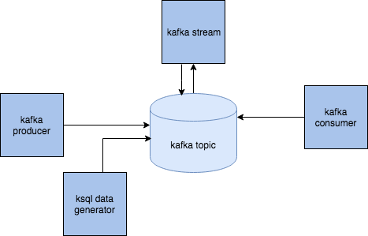
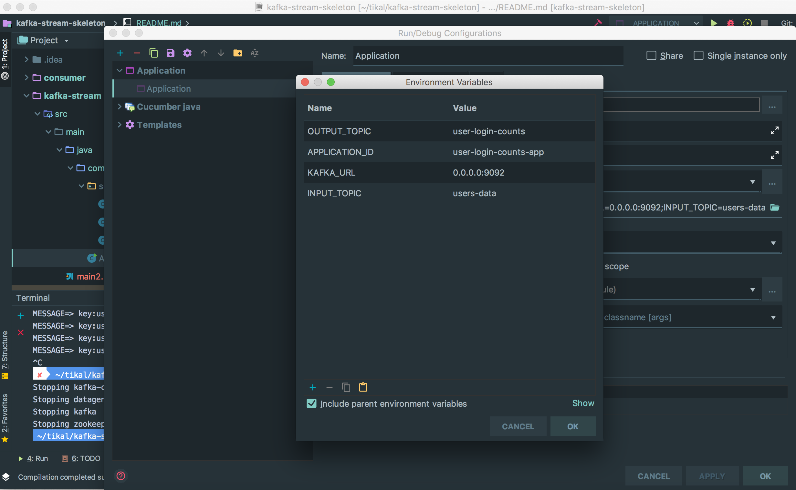

# kafka-stream-skeleton

<p>Kafka stream started project</p>
<ul>
  <li><a href="#Overview">Overview</a></li>
  <li><a href="#Mock-data">Mock data</a></li>
  <li><a href="#Stream-processing">Stream processing</a></li>
  <li><a href="#Consuming-stream-data">Consuming stream data</a></li>
  <li><a href="#Installation">Installation</a></li>
</ul>

## Overview

This skeleton contains :
1. 2 producers (that produce data about users)
2. 1 stream processor (that transform the data)
3. 1 consumer (that just print out the stream output).
4. 1 kafka broker - (using wurstmeister image it will Automatically create topics from docker-compose file)
5. 1 kafka zookeeper
There is a module contains the schema  used for the stream.
There is a module contains the schema1 used for the producer/consumer.



## 2  producers:

1. By data generation
Confluent has great [tool](https://docs.confluent.io/current/ksql/docs/tutorials/generate-custom-test-data.html) to generate data by avro schema.

check also [GitHub page](https://github.com/confluentinc/ksql/tree/master/ksql-examples)

This tool is used by default to fill stream input topic with data.

schema must be located in <root_directory>/schema.

current schema is model.avro that has same types as the model used for stream processing.

schema is used in docker-compose file, in image `datagen`

```yaml
  datagen:
    image: confluentinc/ksql-examples:latest
    container_name: datagen
    volumes:
    - ./schema:/schema
    command: "bash -c 'ksql-datagen \
                      schema=./modelGen/model.avro \
                      key=userName \
                          format=json \
                          topic=users-data \
                          maxInterval=1000 \
                          bootstrap-server=kafka:9092 \
                          propertiesFile=./schema/datagen.properties'"
```

if you will want to change the schema name, just change the value of the attribute in schema, in the bash command.

you may need also to change the key attribute, with the key in your new model.

schema can be very strong tool, check more examples [here](https://github.com/confluentinc/ksql/tree/master/ksql-examples)  
 
2. By custom producer

data can be also produced  by using KafkaProducer class. see the project module producer.

you need to specify the key and value serializations, there are defaults for primitives like String, int, long, byte array, for json we need to write our own class. 

```java
configProperties.put(ProducerConfig.KEY_SERIALIZER_CLASS_CONFIG, "org.apache.kafka.common.serialization.StringSerializer");
configProperties.put(ProducerConfig.VALUE_SERIALIZER_CLASS_CONFIG, "com.kafka_stream_skeleton.producer.serialization.JsonPOJOSerializer");
KafkaConsumer<String, Long> consumer = new KafkaConsumer<>(props);
```
If using this option, you need to uncomment producer image in the docker-compose file, and comment the datagen image

3. you can also run some kafka connect tool to some external source.
 
There is no example here. need to add your own image for it.

## 1 stream processor

First, I recommend to check [confluent stream code example](https://github.com/confluentinc/kafka-streams-examples/tree/5.0.1-post/src/main/java/io/confluent/examples/streams).

Here in this project, Stream processing is done in the stream module, Application class, stream read the input topic data, and does some grouping and aggregation.
stream must define SerDes (Serialization and Deserialization) for key and value, this also need to be defined if grouping/counting/aggregation methods change the key/value type.

```java
Serde<LoginData> loginDataSerde = SerdeBuilder.buildSerde(LoginData.class);

final KStream<String, LoginData> source = builder.stream(INPUT_TOPIC, 
                                           Consumed.with(Serdes.String(), loginDataSerde));

```

and because the counting method change the types, I must specify this:
```java

final Serde<String> stringSerde = Serdes.String();

Serde<LoginCount> loginCountSerde = SerdeBuilder.buildSerde(LoginCount.class);

counts.toStream().map((windowed,count)->new KeyValue<>(windowed.key(),new LoginCount(windowed.key(),count,windowed.window().start(),windowed.window().end())))
                .to(OUTPUT_TOPIC, Produced.with(stringSerde, loginCountSerde));
```

Also here, there are default SerDes for primitive types, and for json need to write our own SerDes.
use the class`com.kafka_stream_skeleton.serialization.SerdeBuilder`, to create a custom SerDes.

## 1 consumer

Stream output data is written in its own topic and need to be consumed, I write some consumer, that just print result to the console.
also here, need to specify correctly the serializers, according to the stream results

```java
props.put("key.deserializer", StringDeserializer.class.getName());
props.put("value.deserializer", "com.kafka_stream_skeleton.consumer.serialization.JsonPOJODeserializer");

KafkaConsumer<String, LoginCount> consumer = new KafkaConsumer<>(props);
    
consumer.subscribe(Arrays.asList(TOPIC));
```

to see output:
```
docker logs kafka-consumer -f
```

also here, you can use some kafka sink connect, to send result to some external system, DB, elasticsearch

### installation

If you want make changes on this repository, don't forget to fork this before cloning.

1. `cd kafka-stream-skeleton`
2. `mvn clean compile package` 
2. add .env file contains your IP, for example:(must be your ip.  use terminal ifconfig | grep "inet " | grep -v 127.0.0.1)
```properties
LOCALHOST_IP=192.168.2.100
```
3. run app

### Run project using docker

 3.1 `docker-compose up -d --build`   
 or  
 3.2 `docker build -t kafka-xxx:v1 .`  
     `docker run  -d --name "hpa-kafka-xxx" -p 9088:9088  hpa-kafka-xxx`
     `docker run wurstmeister/zookeeper`

To make sure all is work, run `docke ps` you may see 6 images:

    1. kafka
    2. zookeeper
    3. kafka-producer-generator
    4. kafka-producer
    5. kafka-stream
    6. kafka-consumer

4. `docker-compose stop `

to stop all images

5. check logs of consumer : `docker logs <CONTAINER_ID>

6. go into machine `docker exec -it <CONTAINER_ID> bash`   
`cd opt/kafka.../bin`
`kafka-topics --list --zookeeper zookeeper:2181`
`kafka-console-consumer --bootstrap-server localhost:9092 --topic users-data --from-beginning`

7. go into zk machine `docker exec -it <CONTAINER_ID> bash`  

`cd bin`
`./zkCli.sh`
`ls /brokers/topics`

### Run project from IDE

You have to go kafka-stream module, and run Application.class.

This class expect to get 4 environment variable:

1. APPLICATION_ID
2. INPUT_TOPIC
3. OUTPUT_TOPIC
4. KAFKA_URL

docker-compose send values for this properties, when running the application from IDE we need to set values for this environment variables.
(intelij, open run configuration, and set this variable with the values in Environment Variable field)

By default, (unless you change topic names and ports), set this values
1. INPUT_TOPIC="users-data" 
2. OUTPUT_TOPIC="user-login-counts" 
3. APPLICATION_ID="user-login-counts-app" 
4. KAFKA_URL="0.0.0.0:29092"
5. CONSUMER_GROUP="user-login-counts-group"




